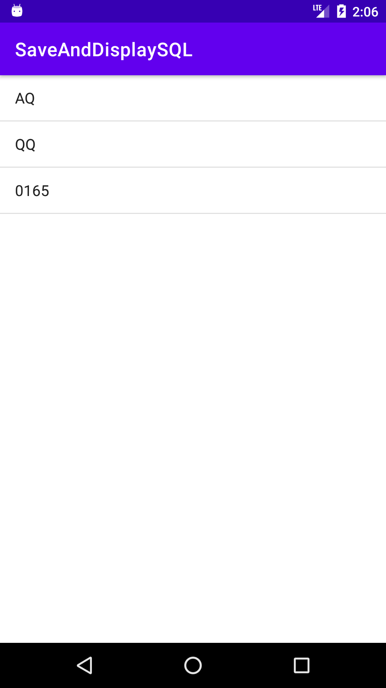

# SQLite Database 

### Basic Functionality 
* Add data into database 
* Show Data into ListView
* Update Data (fetch) from ListView
* Delete Data (fetch) from ListView

**Add Data into database**  

**View Data in ListView**  

